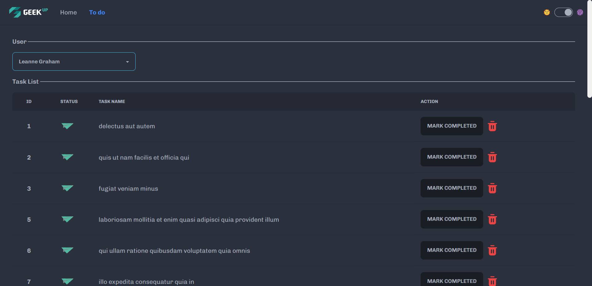

# SIMPLE TO-DO LIST WEB APPLICATION - GEEKUP VIETNAM

## Description:

This is a Todo List Rendering Web App to apply for Front-end intern position at GEEK Up Vietnam Technology JSC. This kinda assessment is using JSON Placeholder API.

## Demo:

    

## Usages:

◇ ReactJS
◇ TailwindCSS
◇ DaisyUI plugin
◇ Axios
◇ JSONPlaceholder Fake APIs

## Having a view:

1️⃣ Cloning github/ Download project main folder to your local device.

2️⃣ Open src path on your using terminal (Command Prompt/ PowerShell/ Git Bash/ VS Code terminal,...)

3️⃣ Install all the dependencies and necessary libraries/modules by runnin' `npm install` or a shorthand like `npm i`

4️⃣ Wait for seconds and then running the project on your local environment by some below steps.

5️⃣ First option is to run development environment for developers by runnin' this command line `npm run dev`

6️⃣ Second option is to run production environment by using `npm install -g serve` (if you haven't installed this before) then `npm run start`

7️⃣ Last option is to remove the whole project and open your using browser then navigate to `https://geek-up-todo.vercel.app/`

8️⃣ 🎉🎉🎉

## Credits:

🫶 Assessment from GeekUp Technology JSC.

🐼 me n my self - An Nguyen - @anguyn
